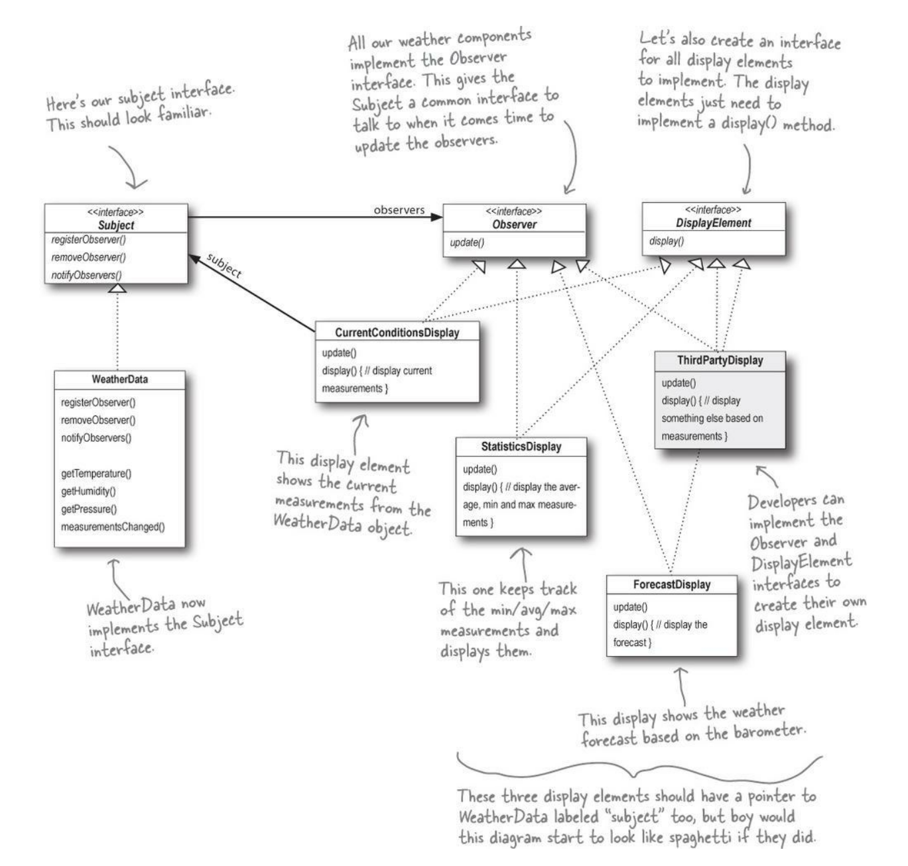

+++
title = "True Observer Pattern with Unsubscribe mechanism using Rust"
date = 2023-02-17
+++

> In memory of all the Rustaceans who stopped learning OOP patterns due to the inability to implement an unsubscribe mechanism in the Observer pattern.

## Will learn the design patterns and become cool, honestly
Idk, how it is with healthy people, but I usually want to finish something, even if I don't need it right now. E.g, read the entire _["Programming Rust"](https://www.oreilly.com/library/view/programming-rust-2nd/9781492052586/)_ book without practicing the knowledge gained, just read it. The main thing is that I read it and can mark it as completed. The same thing happened once when I wanted to learn about all design patterns. Of course not _All_, I found the resource [_Refactoring Guru_](https://refactoring.guru/design-patterns/catalog) and set myself the goal: "understand all patterns and implement them". And now I have a course at the university where we are taught the most popular ones, so I have a lot of time to kill without regret. But my goal sounds boring, doesn't it? So to rack my brain a bit I wanted to implement all patterns in a not _True OOP_ language. __Rust__. _Actually, I recently started learning Rust and thought it'd be a good idea._ After coding 5 of them I realized that _"Refactoring guru"_ wasn't giving me the full picture of design patterns. I read a bit of _Reddit_ and found the book _["Head First Design Patterns"](https://www.oreilly.com/library/view/head-first-design/0596007124/)_. After one chapter I realized that this book is what I need. And now the key objective of this article - the _Observer_ pattern - enters the scene. There were no problems with it, it is a very convenient and useful pattern, but I wouldn't have written so much of a preface if I could easily implement this pattern on Rust.

## I like Rust, cause it doesn't have full OOP... how to implement this OOP feature?
The first month with Rust made me wonder how such a perfect thing is available in our horrible world: no full OOP, error handling, none, match, etc. But for some reason 🙃, when you want to implement a pattern, as it is shown in the book, you suddenly start to lack inheritance and abstract classes... Almost everything can be done using generics, but it isn't interesting, I want it to be like in the book:) It turned out that porting Java to Rust isn't an easy task. Well, it is simple, but up to a certain point. And this point is a comparison of two trait objects. Not sure that you can say _trait objects_, since _trait_ isn't the same as _interface_. Therefore `&dyn Lol == &dyn Lol` doesn't work, but I'd like to. Fortunately, Rust becomes very nice as long you don't insult [they](https://internals.rust-lang.org/t/pronoun-policy/2111/29), and accept their rules of the game.

In this article, I'll tell you how I gathered bits of information from the web and found the best way to compare two _trait objects_ (don't tell me it is obvious, I'll panic). And since I needed it to implement the _Observer_ pattern, I'll show its implementation as if Rust were the _True OOP_ language.

## Um, what's the problem?
_Observer_ is a simple pattern, that can be understood and used in 15 minutes. It works perfectly with C#, Java, and other garbage languages 🤗. However, all the online resources about Rust I've found are missing one feature of the _Observer_ pattern that pissed me off - _Unsubscribe_ mechanism. Article owners completely ignore it or implement it through generics (boring and not very flexible). So I decided to dive in and implement it myself as the discoverer.
In order to write an _unsubscribe_ mechanism, we need to somehow compare two _trait objects_. We don't need to do a deep comparison by value because all we need to know at _unsubscribe_ is whether the two objects are the same by reference.

The most I've come across is this [discussion](https://users.rust-lang.org/t/how-to-compare-two-trait-objects-for-equality/88063) but it's long and not exactly what we need. There is a smaller version of the discussion in the  [blog](https://dev.to/magnusstrale/rust-trait-objects-in-a-vector-non-trivial-4co5). But don't get me wrong, _double dynamic dispatch_ is useful if you want to implement a `PartialEq` for a trait, but there is an easier solution for the Observer pattern since we don't need to compare field by field, we need to compare by reference.

## Sweeter bolder better
[🤥](https://youtu.be/yTa1KzV2Tb8)  
In the observer pattern, especially for _unsubscribe_, there is no need to compare complete objects (field by field), all we need to know is whether the objects point to the same memory location. In early versions of this article, I used `uuid` crate for this task, but with the help of [community](https://www.reddit.com/r/rust/comments/115fejz/comment/j95eq2c/?utm_source=share&utm_medium=web2x&context=3) I learned that _raw pointers_ can simplify code. It's also worth noting that using _double dynamic dispatch_ in the case of the Observer pattern is completely wrong, even though I thought the opposite :) There is a possibility that all the struct fields will be the same, but technically they are different observers since they were created separately.
It will look something like this:
``` rust
fn main() {
    let a = &A::new() as &dyn Foo;
    let b = &A::new() as &dyn Foo;
    assert_ne!(a as *const dyn Foo, b as *const dyn Foo);
    assert_eq!(a as *const dyn Foo, a as *const dyn Foo);
}
trait Foo {}
struct A;
impl A {
    fn new() -> Self {}
}
impl Foo for A {}
```
Now if you were only interested in comparing _trait objects_ as pointers you can close this article, below I'll show a complete implementation of the _Observer_ pattern with lots of _traits_ and no _KISS_.

## Observer
I assume you know what _Observer_ is. In two words: some objects subscribe (they are _Observers_) to news from other objects (they are _Subjects_). When _Subjects_ change their state, they call a certain _Observers_ method and pass information. I'll implement the pattern using an example from the book _"Head First"_.

The task sounds like this: _The three players in the system are the weather station (the physical device that acquires the actual weather data), the WeatherData object (that tracks the data coming from the Weather Station and updates the displays), and the display that shows users the current weather conditions. The WeatherData object knows how to talk to the physical Weather Station, to get updated data. The WeatherData object then updates its displays for the three different display elements: Current Conditions (shows temperature, humidity, and pressure), Weather Statistics, and a simple forecast._



There are two ways to implement the pattern: _"push Observer"_ and _"pull Observer"_. _"Push"_ is when _Subjects_ pass their data to the common interface method `update(data1, data2)`. _"Pull"_ is when _Subjects_ pass themselves to the common interface method, so every _Observer_ can get data that it needs via API `update(&I)`. The second option is considered _better_, because you won't need to change the signature of all methods when adding a new parameter. I show you _"Pull"_.

First, we need to define a _trait_ for _Subjects_ - objects that produce some data. In our case, observers want to get weather data, so we also create some API for them:
``` rust
trait Subject {
    fn register_observer(&mut self, observer: Weak<RefCell<dyn Observer>>);
    fn remove_observer(&mut self, observer: Rc<RefCell<dyn Observer>>);
    fn notify_observer(&mut self);

    fn get_temperature(&self) -> f32;
    fn get_humidity(&self) -> f32;
}
```
`Rc<RefCell<dyn Observer>>`: we want to notify followers and they probably want to change their state too, so we need interior mutability.  
`Weak<RefCell<dyn Observer>>`: _subjects_ do not own their observers, so we have only weak references to them. The observer can be removed at runtime. If this happens, we will simply remove the non-existent reference.

Create one _Subject_ that will report the current temperature:
``` rust
#[derive(Default)]
struct WeatherData {
    temperature: f32,
    humidity: f32,
    pressure: f32,
    observers: Vec<Weak<RefCell<dyn Observer>>>,
}
```

And its implementation. _Actually `set_measurements` is only needed to test our application, in real life data will be obtained from another source_:
``` rust
impl WeatherData {
    fn new() -> Rc<RefCell<Self>> {
        Rc::new(RefCell::new(WeatherData::default()))
    }
    fn set_measurements(&mut self, temp: f32, hum: f32, pres: f32) {
        ...
        self.measurements_changed();
    }
    fn measurements_changed(&mut self) {
        self.notify_observer();
    }
}
```

_Subject_ implementation for _WeatherData_:
``` rust
impl Subject for WeatherData {
    fn register_observer(&mut self, observer: Weak<RefCell<dyn Observer>>) {
        self.observers.push(observer);
    }

    fn remove_observer(&mut self, observer: Rc<RefCell<dyn Observer>>) {
        self.observers.retain(|obj| {
            obj.upgrade().map_or(false, |left_obs| {
                &*left_obs.borrow() as *const dyn Observer
                    != &*observer.borrow() as *const dyn Observer
            })
        })
    }

    fn notify_observer(&mut self) {
        // Removing references to dropped observers
        self.observers.retain(|obj| obj.upgrade().is_some());

        for observer in self.observers.iter() {
            observer
                .upgrade()
                .expect("old links have been deleted")
                .borrow_mut()
                .update(self.temperature, self.humidity, self.pressure);
        }
    }
    
    fn get_temperature(&self) -> f32 {
        self.temperature
    }
    fn get_humidity(&self) -> f32 {
        self.humidity
    }
}
```
Each time before removing or notifying observers we delete nonexistent references (converting from _Weak_ to _Rc_ returns _None_: `weak.upgrade().is_some()`. All implementations of the _Observer_ pattern that I've seen have had no option to _unsubscribe_ from _subject_. I did it 🙂. In some cases, the _generic vector_ `observers: Vec<impl Foo>` was used, and in some cases, this option was completely ignored, which is pointless, since it is one of the power features of the pattern.  

Let's understand what's going on here:
``` rust
self.observers.retain(|obj| {
    obj.upgrade().map_or(false, |left_obs| {
        &*left_obs.borrow() as *const dyn Observer
            != &*observer.borrow() as *const dyn Observer
    })
})
```
We are removing a particular _observer_ from our list of subscribers. `retain` leaves only those elements in the vector for which we return _true_. After checking that the pointer to _observer_ still exists - `upgrade`, we borrow the value from `RefCell`, and since it doesn't return `&dyn Observer`, but returns `Ref<'_, T>`, we need to dereference that value manually. To get the actual pointer, we need to convert our `dyn Observer` to `&dyn Observer`, and only after all these operations does Rust perform the cast to `*const dyn Observer`.

Let's move on to the _Observer_ trait. Note that we pass only a reference to a _Subject_ object to get only the data we need (_Pull Observer_):
``` rust
trait Observer {
    fn update(&mut self, subject: &dyn Subject);
}
```

And one more _trait_ but this is for our specific task (and to freak out). There is a lot of code outside of the scope of this article, most of which is boilerplate code for our current specific task:
``` rust
trait DisplayElement {
    fn display(&self);
}
```
This _trait_ will help us display the current weather (or not only the weather) in different formats.

And structure that has _Observer_ and _DisplayElement_ traits together:
``` rust
struct CurrentConditionsDisplay {
    weather_data: Weak<RefCell<dyn Subject>>,
    temperature: f32,
    humidity: f32,
}
impl CurrentConditionsDisplay {
    fn new(weather_data: Rc<RefCell<dyn Subject>>) -> Rc<RefCell<Self>> {
        let obj = Rc::new(RefCell::new(Self {
            weather_data: Rc::downgrade(&weather_data),
            temperature: 0.0,
            humidity: 0.0,
        }));
        weather_data
            .borrow_mut()
            .register_observer(Rc::downgrade(&obj) as Weak<RefCell<dyn Observer>>);
        obj
    }
}
```
Everything happens here: a new object is created and moved to two smart pointers so that you don't have to do it manually every time in the main; subscribe to the weather feed. We keep a reference to _dyn Subject_ so that you can unsubscribe from news in the future, but I did not write such a method, we will do it manually later.

And the last part of _Observer_ pattern, nothing special:
``` rust
impl Observer for CurrentConditionsDisplay {
    fn update(&mut self, subject: &dyn Subject) {
        self.temperature = subject.get_temperature();
        self.humidity = subject.get_humidity();
        self.display()
    }
}
impl DisplayElement for CurrentConditionsDisplay {
    fn display(&self) {
        println!(
            "Current conditions: {} F degrees and {} humidity.",
            self.temperature, self.humidity
        );
    }
}
```

## Println!("works, lol!")
And in the old tradition of design patterns, we only test this with _print_ statements. But in this case, it will not be very easy to do, because we have a lot of _smart pointers_, so we also have to be smart 👁👄👁 to turn them into something human.
``` rust
let weather = WeatherData::new();
let display1 = CurrentConditionsDisplay::new(weather.clone());
let display2 = StatisticsDisplay::new(weather.clone());

println!("Set #1:");
weather.borrow_mut().set_measurements(10.0, 15.0, 20.0);

display1
    .borrow()
    .weather_data
    .upgrade()
    .unwrap()
    .borrow_mut()
    .remove_observer(display1.clone());
...
```
To unsubscribe from the news, we had to first borrow data from _RefCell_, then try to convert _Weak -> Rc_, then borrow the object again as mutable, because after unsubscribing the notifier changes its state. And only then call an _unsubscribe_ with a cloned _Rc_ pointer.

We run it and see that the unsubscribe works, now the first object does not receive new weather data:
```
Set #1:
Current conditions: 10 F degrees and 15 humidity.
Avg/Min/Max temperature = 10/10/10.
Set #2:
Avg/Min/Max temperature = 15/10/20.
Set #3:
```
"Avg/Min/Max" - this is the output of the second object `StatisticsDisplay`, the code of which I did not show because it is similar to the `CurrentConditionsDisplay`. I also removed it from the news before _Set #3_.

## What we achieved
* We disgraced all OOP principles and wrote ridiculous code that no one will ever write in their life.
* We have implemented the Observer design pattern; I have read the second chapter of _"Head First"_ and can continue reading.
* We compared trait objects by reference without _third-party_ libraries.
* Composition over inheritance :)
* Encapsulation :)

## Hell Yes
Huh, I don't know why I showed so much code when I could just comment out the code and put it on the Rust Playground. Feel free to submit corrections. Link to the code in the _Revisions_ section. Maybe because I wanted to write my first article, which will receive many corrections before it becomes "correct". Because at the time of writing the article, I have only been studying this grail for 2 months. Therefore, if you saw any syntax error (I hate English articles), or my ignorance in some Rust issue, please contact: [_Reddit post_](https://www.reddit.com/r/rust/comments/115fejz/true_observer_pattern_with_unsubscribe_mechanism/?utm_source=share&utm_medium=web2x&context=3) or _yurii.shymon@gmail.com_.

Cheers 🦆

---

## Revisions
* 2023-02-19: [Compare trait objects with `*const` instead of `PartialEq` and `uuid`](https://play.rust-lang.org/?version=stable&mode=debug&edition=2021&gist=b2d927d15a4e603d844edf09178a9ed0)
* 2023-02-18: [Changed implementation from _Push_ to _Pull_ Observer](https://play.rust-lang.org/?version=stable&mode=debug&edition=2021&gist=2b6b1e4b30d024c50fc3cba42516e98e)
* 2023-02-17: [Original post](https://play.rust-lang.org/?version=stable&mode=debug&edition=2021&gist=784ec053e7bcb8f2d4ebe4a36d902ef0)
